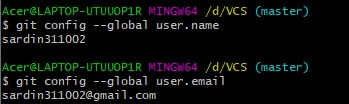

# Latihan21
**NAMA : SARDIN**  

**NIM : 312010135**  

**KELAS : TI.20.A.1**  

## Langkah-langkah penggunaan git

* Download Git terlebih dahulu, dengan link berikut ini : [click here](https://git-scm.com)  

* Setelah file terdownload, silahkan lakukan instalasi dengan referensi berikut ini :[ Git Installation Guide](https://https://git-scm.com/book/en/v2/Getting-Started-Installing-Git)  

* Setelah installasi selesai, buka *software* **GitBash** pada menu di Windows, dan lakukan pengecekan **versi**, dengan mengetik syntax berikut :  

`git --version`

* Jika muncul tampilan **git version**, berarti Git sudah **berhasil di install** dan **bisa digunakan**. Langkah pertama kita harus **mengkonfigurasi user nama** dan **email** di **Git**, dengan mengetikkan syntax berikut :  

`git config --global user.name "masukan nama anda"`  
`git config --global user.email "masukan email anda"`  

* Setelah diisi, silahkan lakukan pengecekan user nama dan email, dengan mengetikkan perintah berikut :  

`git config --global user.name`  
`git config --global user.email`  

* Buat akun di**GitHub**,seperti contoh dibawah ini.Dan lakukan Verifikasi akun melalui email yang sudah terdaftar  

* Jika akun **GitHub** sudah selesai dibuat dan di verifikasi,proses selanjutnya silahkan buat Repository seperti gambar dibawah ini: **Penjelasan**  

> * `Repository Name : (Silahkan isi nama repository yang diinginkan, seperti contoh saya ingin membuat repository LatihanVCS)`  
> * `Description : (Isi dengan deskripsi atau penjelasan tentang repository Anda)`  
> * `Public / Private : (PIlih salah satu jenis repository akan bisa dilihan sama semua orang atau tidak)`  
> * `Add a README.md file : Centang pada bagian ini jika Anda menginginkan file README.md ada di repository Anda`  
> * `Add .gitignore : Merupakan sebuah file yang berisi daftar nama-nama file dan direktori yang akan diabaikan oleh Git.`  
> * `Choose a license : Silahkan centang jika Anda memiliki lisensi pada repository yang akan dibuat Kemudian tekan tombol Create Repository untuk menyimpan`  

* Jika repository sudah dibuat maka akan muncul tampilan seperti dibawah ini :

foto 